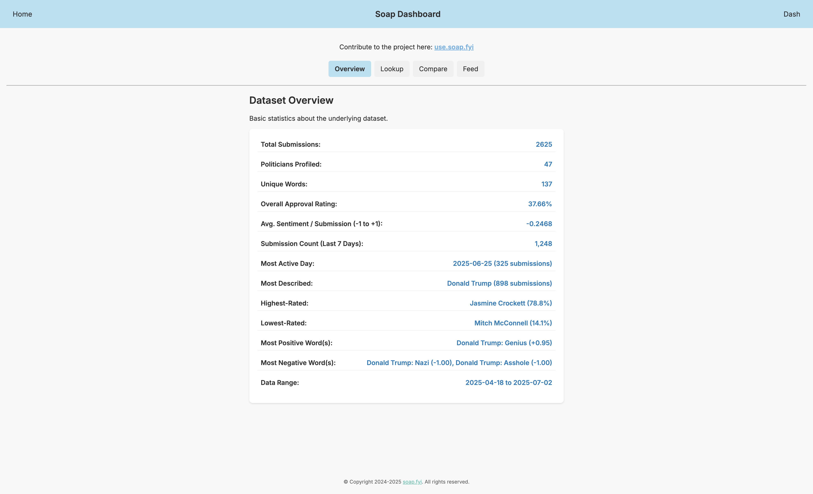
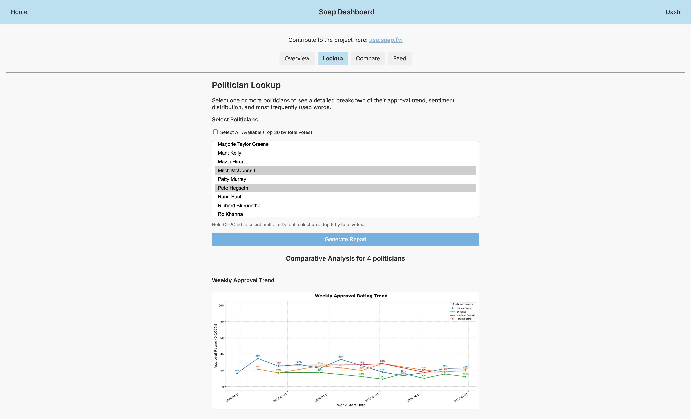
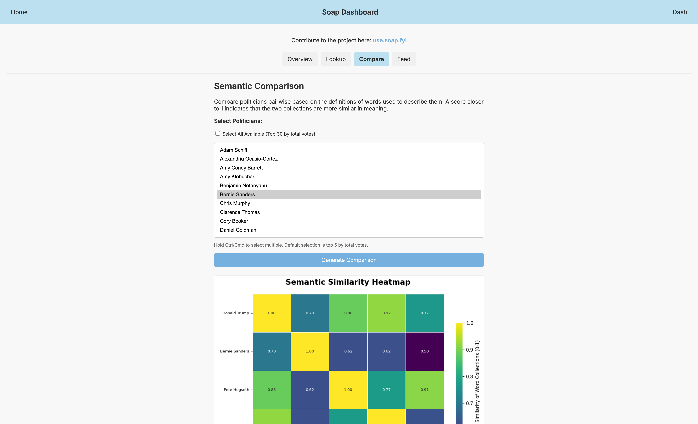
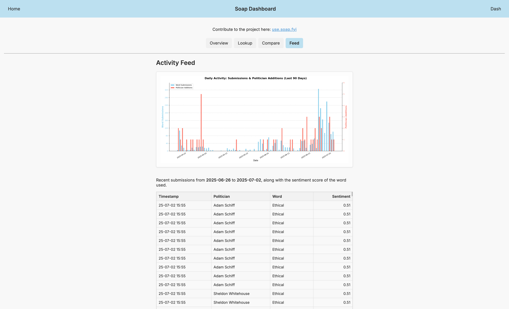

# Soap Dashboard

**View it here: [dash.soap.fyi](https://dash.soap.fyi)**

This dashboard is for the [Soap polling project](https://www.soap.fyi). It provides multiple views of the collected data, allowing users to explore statistics, analyze individual politicians, compare them semantically, and monitor recent activity.

## Features

The dashboard is organized into four tabs:

*   **Overview Tab:**
    *   Presents a summary of the entire dataset.
    *   Displays key metrics such as Total Submissions, Politicians Profiled, Overall Approval Rating, Most Described Politician, Highest/Lowest-Rated Politicians, and more.

*   **Lookup Tab:**
    *   Provides a detailed analysis for one or more selected politicians.
    *   Allows multi-selection or an "All Available" mode (up to 30 politicians).
    *   Generates a view with three components:
        1.  **Weekly Approval Trend:** A multi-line chart comparing the weekly approval ratings of the selected politicians over time.
        2.  **Sentiment Distribution:** A series of histograms showing the spread of sentiment scores for each selected politician, with median scores highlighted.
        3.  **Top Weekly Words:** A data table for each politician showing their most frequently used descriptive word for each week.

*   **Compare Tab:**
    *   Conducts a semantic similarity analysis to compare politicians based on the *meaning* of the words used to describe them.
    *   Uses `spaCy` word vectors to calculate the cosine similarity between the collections of words associated with each politician.
    *   Renders a heatmap to visualize the pairwise similarity scores.

*   **Feed Tab:**
    *   Shows recent project activity.
    *   Features a **Daily Activity Graph** showing total word submissions and new politician additions over the last 90 days.
    *   Includes an **Activity Feed Table** listing the most recent individual submissions.

## Tech Stack

*   **Backend:** Python, Flask
*   **Web Server:** Gunicorn
*   **Data Handling:** Pandas, SQLAlchemy (for PostgreSQL interaction)
*   **Plotting:** Matplotlib, Seaborn (generating images served to the frontend)
*   **Semantic Analysis:** `spaCy` with the `en_core_web_md` model for word vector calculations.
*   **Frontend & Optimizations:**
    *   HTML, Jinja2, CSS
    *   `Flask-Compress` for Gzip compression.
    *   `Flask-Assets` for CSS minification and bundling.
*   **Database:** PostgreSQL
*   **Deployment:** Railway.app (using `nixpacks.toml` for environment setup)

## Getting Started

### Prerequisites

*   Python 3.9+
*   `pip` (Python package installer)
*   PostgreSQL server (running locally or accessible remotely)
*   Git (for cloning the repository)

### Local Development Setup

1.  **Clone the Repository:**
    ```bash
    git clone https://github.com/brayvid/soap-dash.git
    cd soap-dash
    ```

2.  **Create and Activate a Virtual Environment:**
    ```bash
    python -m venv venv
    source venv/bin/activate  # On macOS/Linux
    # venv\Scripts\activate    # On Windows
    ```

3.  **Install Dependencies:**
    This command installs all required packages, including the specific `spaCy` model from the URL in the file.
    ```bash
    pip install -r requirements.txt
    ```

4.  **Set Up Environment Variables:**
    Create a `.env` file in the root of the project directory (`soap-dash/.env`). This file will store your database credentials and Flask settings.

    ```env
    # --- .env file for LOCAL DEVELOPMENT ---
    FLASK_APP=app.py
    FLASK_ENV=development # Enables debug mode and auto-reloader
    # DEPLOY_ENV=DEVELOPMENT # Defaults to DEVELOPMENT if not set in app.py

    # PostgreSQL Database Credentials (unsuffixed for local dev)
    DB_USERNAME=your_local_db_username
    DB_PASSWORD=your_local_db_password
    DB_HOST=localhost
    DB_DATABASE=your_local_db_name
    DB_PORT=5432 # Or your PostgreSQL port if different
    ```
    Replace `your_local_db_username`, etc., with your actual local PostgreSQL credentials.

5.  **Database Schema & Data:**
    Ensure your PostgreSQL database has the necessary tables (`politicians`, `words`, `votes`) and is populated with data.

6.  **Run the Flask Application:**
    Using the Python module flag is the recommended way to run the app with the correct virtual environment.
    ```bash
    # Ensure your virtual environment is active
    python -m flask run
    ```
    The application should now be running on `http://127.0.0.1:5001` (or the port you have configured).

### Directory Structure

```
soap-dash/
├── app.py                 # Main Flask application logic, routes, and plotting
├── static/
│   ├── gen/
│   │   └── packed.css     # Minified CSS bundle created by Flask-Assets
│   └── styles.css         # Source CSS for styling
├── templates/
│   ├── base.html          # Base HTML template (navbar, footer, common structure)
│   ├── index.html         # Main multi-tab dashboard template
│   ├── error.html         # Template for critical database errors
│   └── 404.html           # Custom 404 page not found template
├── .env                   # Local environment variables (ignored by Git)
├── requirements.txt       # Python dependencies, including the spaCy model URL
├── nixpacks.toml          # Nixpacks config for Railway deployment
├── Procfile               # Start command for Gunicorn
├── runtime.txt            # Specifies the Python version for deployment
└── README.md              # This file
```

## Deployment

This application is configured for deployment on platforms like [Railway.app](https://railway.app/) or Heroku.

**For Railway (Example):**

1.  Push your code to a GitHub repository.
2.  Create a new project on Railway and connect it to your GitHub repository.
3.  Railway will use `nixpacks.toml` to set up the environment and `Procfile` to determine the start command: `gunicorn app:app`.
4.  Configure the necessary environment variables in the Railway service settings. The application code will automatically look for variables with a `_PROD` suffix when `DEPLOY_ENV=PRODUCTION`.
    *   `DEPLOY_ENV=PRODUCTION`
    *   `DB_USERNAME_PROD`
    *   `DB_PASSWORD_PROD`
    *   `DB_HOST_PROD`
    *   `DB_DATABASE_PROD`
    *   `DB_PORT_PROD`

---





---
<p align="center">&copy; Copyright 2024-2025 <a href="mailto:info@soap.fyi">soap.fyi</a>. All rights reserved.</p>